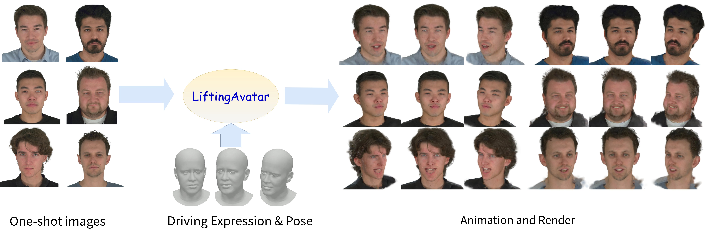

# LiftingAvatar: One-Shot 3D Gaussian Avatar Generation and Animation
LiftingAvatar is a one-shot 3D avatar generation and animation framework. It takes only a single portrait image as input, and reconstructs a photorealistic 3D Gaussian avatar that can be driven by arbitrary expression and pose control signals.

---

## 🎬 Pipeline Overview
Given a single-shot portrait of any person, our system reconstructs a full 3D avatar, then animates it with different expressions and head poses. The output produces view-consistent results across novel viewpoints.

 
<em>Pipeline overview of LiftingAvatar</em>

---

## 🏆 Qualitative Results & Comparisons

### 1. Novel-view Comparison
We compare our method against prior work in terms of facial details (mouth, eyes):
- It preserves fine textures (beard, skin details) than some former methods.
- Rendering artifacts (blur, ghosting) in different views are reduced.

 
<em>Novel-view Comparison comparison with baseline methods</em>

### 2. Cross- and Self-Reenactment
- **Cross-reenactment**: Transferring expressions and poses from a different person to the generated avatar, while preserving the original subject’s identity.
- **Self-reenactment**: Replicating the original subject’s movements.

 
<em>Cross-reenactment and self-reenactment results</em>

